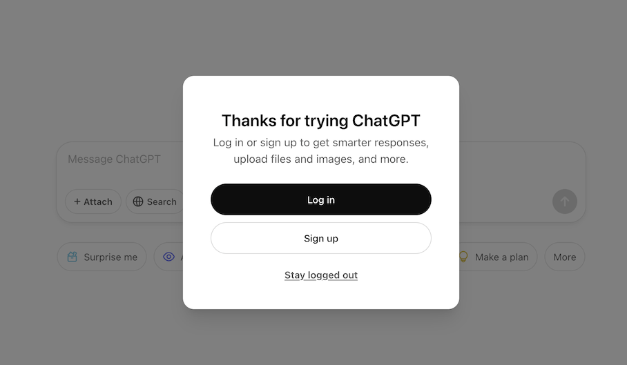

# ChatGPT - Stay Logged Out

A chrome extension that automatically clicks on the "Stay logged out" button of the irritating popup when you open ChatGPT.

## Why StayLoggedOut?

You can choose to login to avoid this popup, but some users prefer to stay private.

## Screenshot
The following popup will be removed automatically:
<h1 align="center">
    
</h1>

## Installation

* Download the project ZIP (<a href="https://github.com/itsluminous/StayLoggedOut/releases">Releases</a>) or clone this repository
* Go to <a href="chrome://extensions">chrome://extensions</a>
* Enable <a href="https://www.mstoic.com/enable-developer-mode-in-chrome/">Developer mode</a> by toggling the switch on top right corner
* Click **"Load unpacked"**
* Select the entire StayLoggedOut folder
* You can forget about it now. It will do the magic in background.
